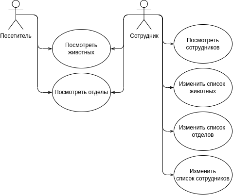
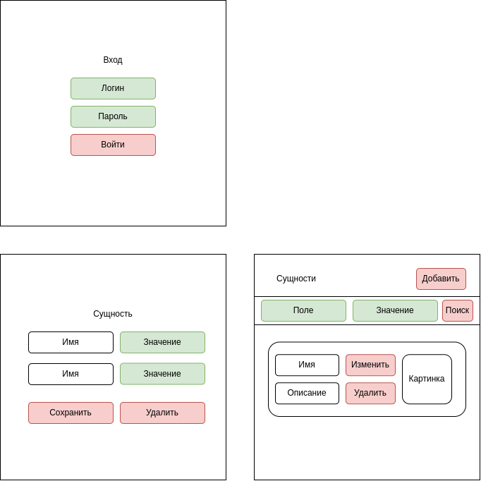
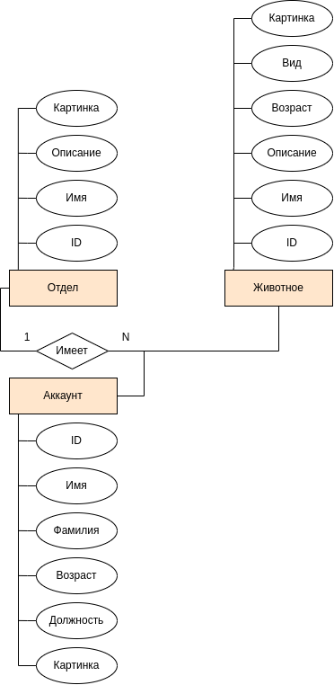

# Лабораторная работа 1

## Цель работы

Приложение помогает организовать деятельность зоопарка. Ведется учет сотрудников, зверей, инвесторов, отделов. Так же позволяет анализировать и организовывать закупки, и растраты ресурсов (корм, наполнитель и т.д.). Дает общую информацию посетителям о зоопарке.

## Функциональные требования

Приложение должно предоставлять:

-- Авторизация

-- Просмотр информации о животном/отделе/сотруднике

-- Изменение информации о животном/отделе/сотруднике

-- Поиск животного/отдела/сотрудника по конкретному полю


## Use-case диаграмма системы.



## Экраны будущего приложения на уровне черновых эскизов.



## ER-диаграмма сущностей системы.




## Балансировка

Get Balance ApacheBenchmark

```
ab -i -n 10000 -c 100 http://localhost/animal > /home/nastya/Desktop/University/7_semester/Web/get_balance_res_test
```


```
This is ApacheBench, Version 2.3 <$Revision: 1879490 $>
Copyright 1996 Adam Twiss, Zeus Technology Ltd, http://www.zeustech.net/
Licensed to The Apache Software Foundation, http://www.apache.org/

Benchmarking localhost (be patient)


Server Software:        nginx/1.18.0
Server Hostname:        localhost
Server Port:            80

Document Path:          /animal
Document Length:        0 bytes

Concurrency Level:      100
Time taken for tests:   0.888 seconds
Complete requests:      10000
Failed requests:        0
Non-2xx responses:      10000
Total transferred:      1590000 bytes
HTML transferred:       0 bytes
Requests per second:    11264.24 [#/sec] (mean)
Time per request:       8.878 [ms] (mean)
Time per request:       0.089 [ms] (mean, across all concurrent requests)
Transfer rate:          1749.04 [Kbytes/sec] received

Connection Times (ms)
              min  mean[+/-sd] median   max
Connect:        0    4   0.9      4      13
Processing:     1    5   1.1      5      14
Waiting:        0    4   1.1      4      14
Total:          5    9   1.4      9      18

Percentage of the requests served within a certain time (ms)
  50%      9
  66%      9
  75%     10
  80%     10
  90%     10
  95%     10
  98%     11
  99%     14
 100%     18 (longest request)
```


Get No Balance ApacheBenchmark

```
ab -i -n 10000 -c 100 http://localhost/animal > /home/nastya/Desktop/University/7_semester/Web/get_no_balance_res_test
```


```
This is ApacheBench, Version 2.3 <$Revision: 1879490 $>
Copyright 1996 Adam Twiss, Zeus Technology Ltd, http://www.zeustech.net/
Licensed to The Apache Software Foundation, http://www.apache.org/

Benchmarking localhost (be patient)


Server Software:        nginx/1.18.0
Server Hostname:        localhost
Server Port:            80

Document Path:          /animal
Document Length:        0 bytes

Concurrency Level:      100
Time taken for tests:   0.970 seconds
Complete requests:      10000
Failed requests:        0
Non-2xx responses:      10000
Total transferred:      1590000 bytes
HTML transferred:       0 bytes
Requests per second:    10306.51 [#/sec] (mean)
Time per request:       9.703 [ms] (mean)
Time per request:       0.097 [ms] (mean, across all concurrent requests)
Transfer rate:          1600.33 [Kbytes/sec] received

Connection Times (ms)
              min  mean[+/-sd] median   max
Connect:        0    4   0.8      4      11
Processing:     1    6   1.1      5      12
Waiting:        0    4   1.1      4      10
Total:          5   10   1.2     10      15

Percentage of the requests served within a certain time (ms)
  50%     10
  66%     10
  75%     10
  80%     10
  90%     11
  95%     11
  98%     13
  99%     13
 100%     15 (longest request)
```

